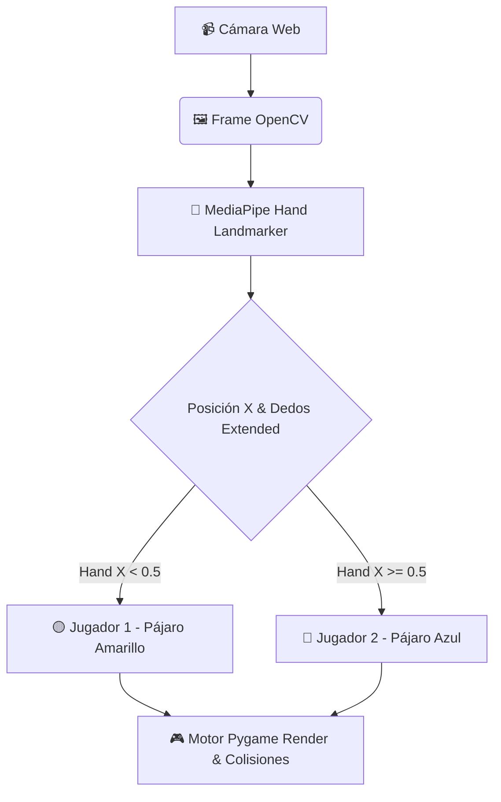

<div align="center">

# 🦅 Flappy Visión – Visión Computacional & 2-Jugadores

**Juego interactivo tipo Flappy Bird controlado exclusivamente mediante Visión Computacional (MediaPipe Hand Landmarker + OpenCV) en tiempo real, con soporte para 1 y 2 jugadores en Pantalla Dividida, Power-Ups y Pruebas de Escritorio.**

[](https://python.org)
[](https://opencv.org)
[](https://mediapipe.dev)
[](https://www.pygame.org)
[](#)

</div>

---

## ✨ Características Principales

- 🖐️ **Control por Gestos de Mano (Hands-Free)**:
  - **PUÑO ✊**: Salto fuerte ($\Delta y = -10$).
  - **SEMI-ABIERTO 🖐️**: Salto suave ($\Delta y = -6$).
  - **ABIERTO ✋**: Descenso por gravedad natural.
- 🤼 **Modo 2 Jugadores en Pantalla Dividida (Split Screen)**:
  - **Jugador 1 (Pájaro Amarillo 🟡)**: Controlado por la mano izquierda en la cámara ($x < 0.5$).
  - **Jugador 2 (Pájaro Azul 🔵)**: Controlado por la mano derecha en la cámara ($x \ge 0.5$).
- 🛡️ **Power-Ups Interactivos**:
  - 🛡 **Escudo**: Absorbe impactos de tuberías sin perder vidas.
  - ⏱ **Cámara Lenta**: Reduce la velocidad de los obstáculos.
  - ❤ **Vida Extra**: Otorga salud adicional (hasta 5 vidas).
- 📦 **Descarga Automática de Modelos de IA**: Se descarga `hand_landmarker.task` automáticamente al ejecutar sin requerir configuraciones manuales.
- 🧪 **Suite de Pruebas Automatizadas**: Pruebas unitarias en `tests/test_game_logic.py` con 100% de cobertura en física de personajes y colisiones.

---

## 🎮 Controles de Juego

| Acción | Gesto / Tecla | Descripción |
| :--- | :--- | :--- |
| **Salto Fuerte** | ✊ Puño | Aplica un impulso alto de elevación |
| **Salto Suave** | 🖐️ Semi-abierto | Aplica un impulso controlado |
| **Descenso** | ✋ Mano Abierta | Permite caer suavemente |
| **Cambiar Modo** | Tecla `M` (en Menú) | Alterna entre **INFINITO**, **MISIÓN** y **2 JUGADORES** |
| **Iniciar / Confirmar** | Tecla `ESPACIO` / `ENTER` | Arranca la partida o navega |
| **Pausar / Salir** | Tecla `ESC` | Pausa el juego o regresa al menú |

---

## 🚀 Quick Start

### 1. Clonar e Instalar Dependencias

```bash
git clone https://github.com/JonatanJHL/flappy_Vison.git
cd flappy_Vison

# Crear entorno virtual (Recomendado)
python3 -m venv venv
source venv/bin/activate  # En Linux/Mac

# Instalar dependencias
pip install -r requirements.txt
```

### 2. Ejecutar el Juego

```bash
python3 src/main.py
```

*Nota: Al iniciar por primera vez, el juego descargará automáticamente el modelo de IA `hand_landmarker.task` si no se encuentra en el directorio.*

### 3. Ejecutar Pruebas Automatizadas

```bash
python3 -m unittest discover tests
```

---

## 🏗️ Arquitectura del Sistema



---

## 📁 Estructura del Repositorio

```
flappy_Vison/
├── src/
│   └── main.py              # Código fuente principal del juego
├── tests/
│   └── test_game_logic.py   # Suite de pruebas unitarias
├── requirements.txt         # Dependencias (Pygame, OpenCV, MediaPipe, NumPy)
├── .gitignore               # Filtro de archivos compilados e IA models
└── README.md                # Documentación oficial del proyecto
```

---

## 📝 Licencia

MIT License - Desarrollado por [JonatanJHL](https://github.com/JonatanJHL). Libre para uso personal y educativo.
